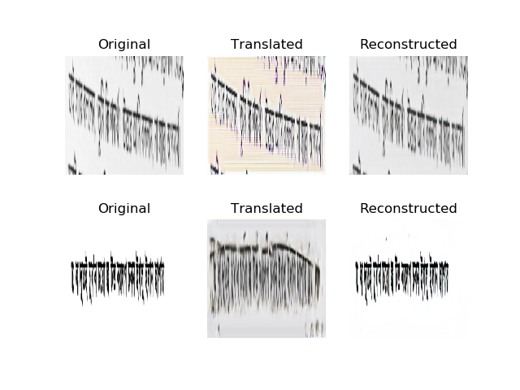

### raw2syn - Raw to synthetic domain transformation for OCR image data. 

Here, the task is to devise a model which learns the function or mapping between the two domains. The motivation for using cyclegan are twofold: the architecture uses and end-to-end approach; training does not require pairs of images but rather requires two unpaired collection of data points from different distributions. This is, in our case, real world(Domain A) and synthetic(Domain B) OCR images. 

#### Codebase structure

* `dataset`: training data
* `images`: save generated images here 
* `saved_model`: save weights and model configurations here
* `test_imgs`: images for testing/generating target domain images
* `outputs` : demo images for showing output
* `.py` files #python scripts for training and inference

#### Dataset directory strucuture:

This is divided in the following file structure for the training regiment. The images are all in JPG format. For training, we construct our dataset which consists of the two categories of data points; real world and synthetic OCR images which are resized to 256x256. For both distributions we use 4000 samples, a total of 8000 samples for training. More training details [here](https://github.com/hasibzunair/raw2syn/blob/master/cyclegan_ocr.py). Not sharing the dataset here as I am not allowed to lol.

```
dataset/
	raw-to-syn/
		Domain_A/
			# all real world OCR images
		Domain_B/
			# all synthetic OCR images
		
		# 80% of Domain_A and Domain_B
		train_A/
			# real world images for training				    
		train_B/
			# synthetic images for training
		
		# 20% of Domain_A and Domain_B
		test_A/
			# around 300 samples real world images
		test_B/
			# around 300 samples synthetic images
```


### Usage

As always, run `pip install requirements.txt` for necessary packages. 

### Training

Output when training is initiated.


Output during the end of training.



### Inference

Using the [generator script](https://github.com/hasibzunair/raw2syn/blob/master/generate.py) which transforms image from real OCR image to a synthetic OCR image. The output is given below.

Input to the generator:


Output from the generator:


###  Referece
* [Unpaired Image-to-Image Translation using Cycle-Consistent Adversarial Networks](https://arxiv.org/abs/1703.10593)
* [Keras-GAN](https://github.com/eriklindernoren/Keras-GAN)
